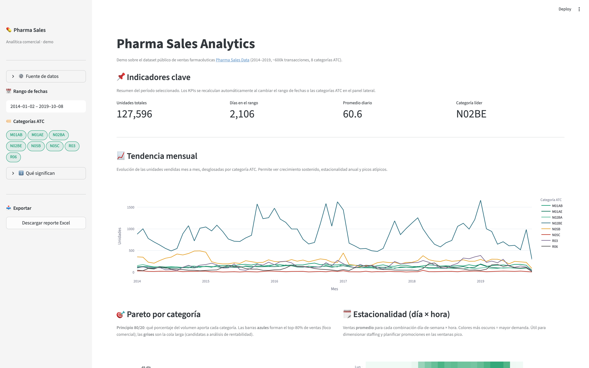

# 💊 Pharma Sales Analytics

> Demo end-to-end de analítica comercial sobre ventas farmacéuticas (POS, 2014–2019, ~600k transacciones, 8 categorías ATC). Proyecto de portafolio para el puesto de **Analista de Datos – Equipo Comercial** en la industria farmacéutica.

[](https://pharma-sales-analytics-lbjwb2xsmvnkfqgathflf9.streamlit.app/)
[](https://github.com/mathiasmtt/pharma-sales-analytics/actions/workflows/ci.yml)
[](https://www.python.org/)
[](https://streamlit.io/)
[](#-tests-y-calidad)
[](LICENSE)

---

## 🚀 Demo en vivo

👉 **[pharma-sales-analytics-lbjwb2xsmvnkfqgathflf9.streamlit.app](https://pharma-sales-analytics-lbjwb2xsmvnkfqgathflf9.streamlit.app/)** 👈

Dashboard interactivo deployado en Streamlit Cloud. Si la app está dormida (tras inactividad prolongada), puede tardar ~30 segundos en despertar.

## 📸 Vista del dashboard



> *Para regenerar la captura: correr el dashboard localmente (ver [Cómo correrlo](#-cómo-correrlo-localmente)) y guardar la imagen en `docs/screenshots/dashboard.png` (`mkdir -p docs/screenshots`).*

## 🎨 Paleta visual — alineada a Megalabs

El dashboard adopta deliberadamente la **identidad corporativa de Megalabs** ([megalabs.com.uy](https://www.megalabs.com.uy/)) para que la herramienta se sienta nativa del ecosistema del laboratorio:

| Uso | Color | HEX |
|---|---|---|
| Primario (Megalabs) | 🟩 | `#149971` |
| Verde oscuro (acento) | 🟩 | `#0f7258` |
| Verde claro (secundario) | 🟩 | `#4fb893` |
| Gris neutro (cola Pareto) | ⬜ | `#d2d2d2` |
| Texto | ⬛ | `#32373c` |
| Background | ⬜ | `#ffffff` |

**Dónde se aplica:**

- **Pareto**: las categorías del top-80 se pintan en verde Megalabs; la cola larga en gris neutro. La lectura es instantánea: "lo verde es donde está el foco comercial".
- **Heatmap de estacionalidad**: escala secuencial de blanco a verde Megalabs — los picos de demanda se "iluminan" en el color de la marca.
- **Tendencia mensual**: paleta cualitativa de 8 colores construida alrededor del verde corporativo (3 verdes + teal + ámbar + rojo + violeta + gris) para distinguir las 8 categorías ATC sin perder coherencia.
- **YoY**: escala divergente **rojo → blanco → verde Megalabs**. Refuerza la convención universal (verde = bien, rojo = alerta) anclándola al color de la empresa.
- **Tema Streamlit** (`.streamlit/config.toml`): light theme, primary `#149971`, tipografía sans-serif.

**Cómo se obtuvo la paleta:** los HEX se extrajeron automáticamente del CSS público del sitio oficial (`curl https://www.megalabs.com.uy/ | grep -oE '#[0-9a-fA-F]{6}'`). El verde `#149971` aparece 37 veces en la hoja de estilos — es inequívocamente el color corporativo dominante.

La paleta está centralizada como constantes al inicio de [`app/streamlit_app.py`](app/streamlit_app.py) (`MEGA_GREEN`, `MEGA_GREEN_SCALE`, `MEGA_DIVERGING`, …) para que cualquier cambio futuro se propague a todos los gráficos desde un único lugar.

## 🎯 Qué resuelve

El equipo comercial de un laboratorio necesita responder tres preguntas en cada reunión de seguimiento:

1. **¿Cuándo vender más?** — identificar ventanas horarias y días pico para optimizar staffing y promociones.
2. **¿Dónde concentrar el foco?** — qué categorías del portfolio concentran el grueso de las ventas (Pareto).
3. **¿Qué está cambiando?** — qué categorías crecen y cuáles decrecen año a año (YoY).

Este proyecto responde las tres con código reproducible, un dashboard interactivo, tests automatizados y un reporte Excel descargable con un click.

## 🧠 3 insights del dataset real

Ejecutados sobre `salesdaily.csv` (2.106 días, 2014-01 → 2019-10):

### 1️⃣ Una sola categoría domina — 49% del volumen

```
N02BE (Analgésicos — pirazolonas y anilidas)   49.4%  ⬅ casi la mitad
N05B  (Ansiolíticos)                           14.6%
R03   (Respiratorias)                           9.1%
─────────────────────────────────────────────────────
3 de 8 categorías = 73% de las ventas
```
**Acción:** asegurar nunca-quiebre-de-stock en N02BE; es existencial para el negocio.

### 2️⃣ Crecimiento YoY 2018 vs 2019 (ene-sep comparables)

```
Crecen:   M01AB (+3.4%), N05C (+1.5%)
Caen:     N02BE (−11.5%), N05B (−12.8%)   ⬅ alerta estratégica
```
**Acción:** las 2 categorías más vendidas están en caída fuerte. Investigar causa (pricing, competencia, cambio regulatorio) antes del próximo Q.

### 3️⃣ La demanda tiene ventanas horarias claras

El heatmap día×hora (visible en el dashboard) muestra picos concentrados en horarios específicos.
**Acción:** reasignar staffing y material POP a las top-5 ventanas día-hora; liberar recursos de las ventanas de baja demanda.

> Narrativa completa y reproducible en [`notebooks/01_insights_comerciales.ipynb`](notebooks/01_insights_comerciales.ipynb).

## 🏗️ Arquitectura

Separación de responsabilidades estricta: IO, lógica analítica, reporting y presentación viven en capas independientes y testeables.

```
pharma/
├── app/
│   └── streamlit_app.py       # Capa de presentación (dashboard)
├── data/
│   ├── raw/                   # CSV originales (gitignored)
│   └── context/               # Documentación del dominio
├── notebooks/
│   └── 01_insights_comerciales.ipynb
├── src/
│   ├── data_loader.py         # Carga + validación + reconciliación
│   ├── analytics.py           # KPIs, estacionalidad, Pareto, YoY, desvíos
│   └── reporting.py           # Generación de Excel multi-hoja
├── tests/                     # pytest — 33 tests, ejecutan en < 1s
│   ├── conftest.py
│   ├── test_data_loader.py
│   ├── test_analytics.py
│   └── test_reporting.py
├── .github/workflows/ci.yml   # CI: ruff + pytest
├── docs/screenshots/          # Capturas del dashboard
├── .streamlit/config.toml     # Tema custom
├── pyproject.toml
├── requirements.txt           # Para Streamlit Cloud
├── LICENSE
└── README.md
```

El notebook, la app y el generador de Excel **consumen las mismas funciones** de `src/` — un único lugar donde corregir un bug se propaga a todos los consumidores.

## ✨ Funcionalidades del dashboard

- **KPIs en tiempo real** (unidades, días, promedio, categoría líder) — recalculan con filtros.
- **Filtros interactivos** por rango de fechas y categoría ATC (vía `st.pills`).
- **Tendencia mensual** por categoría (Plotly).
- **Pareto** con highlight automático del top 80.
- **Heatmap** día-de-semana × hora para estacionalidad.
- **YoY** con corrección de meses comparables.
- **Detector de desvíos** con slider de umbral configurable.
- **📥 Descarga Excel**: reporte multi-hoja generado on-the-fly (Resumen, Pareto, Tendencia, YoY, Top Meses, Desvíos).

## 🔧 Cómo correrlo localmente

**Prerequisitos:** Python 3.11+ y [`uv`](https://docs.astral.sh/uv/).

```bash
# 1. Clonar
git clone https://github.com/mathiasmtt/pharma-sales-analytics.git
cd pharma-sales-analytics

# 2. Instalar dependencias
uv sync --extra dev

# 3. Descargar el dataset de Kaggle y colocarlo en data/raw/
#    https://www.kaggle.com/datasets/milanzdravkovic/pharma-sales-data
#    Archivos esperados:
#      - salesdaily.csv  - saleshourly.csv
#      - salesweekly.csv - salesmonthly.csv

# 4. Correr el dashboard
uv run streamlit run app/streamlit_app.py

# 5. Abrir el notebook
uv run jupyter lab notebooks/01_insights_comerciales.ipynb

# 6. Correr los tests
uv run pytest -v
```

## 🧪 Tests y calidad

- **33 tests** (`pytest`) sobre `data_loader`, `analytics` y `reporting`. Ejecutan en < 1s.
- **Fixtures sintéticas** en `conftest.py` → los tests no dependen del dataset real (el CI corre sin CSV).
- **Linting** con `ruff` (PEP 8 + imports ordenados).
- **CI en GitHub Actions** corre ruff + pytest en cada push.

```bash
uv run pytest -v      # 33 passed in 0.4s
uv run ruff check .   # All checks passed
```

## 🧩 Stack técnico

| Capa | Herramienta | Justificación |
|---|---|---|
| Gestión de entorno | `uv` | Reproducibilidad, velocidad |
| Análisis | `pandas` | Estándar de facto, ecosistema maduro |
| Visualización | `plotly` | Interactivo, misma API en notebook y Streamlit |
| Dashboard | `streamlit` | Deploy gratuito, iteración rápida |
| Excel | `openpyxl` | Escritura multi-hoja con formato |
| Tests | `pytest` + fixtures | Cobertura de lógica pura |
| Lint | `ruff` | Rápido, PEP 8 + imports |
| CI | GitHub Actions | Validación automática en cada push |

## 📐 Decisiones de diseño

- **Funciones puras en `analytics.py`**: no leen archivos ni mutan estado. Facilita testing y reutilización entre notebook / dashboard / Excel.
- **Módulo `reporting.py` independiente**: la lógica de generación de Excel está desacoplada del análisis. Si mañana se agrega un export a PDF, es una nueva función en el mismo módulo sin tocar nada más.
- **Validación temprana** en `data_loader`: fallar rápido con mensajes accionables cuando faltan columnas.
- **Reconciliación cruzada** entre granularidades diaria y mensual como control de calidad automático — práctica estándar en data engineering.
- **YoY con meses comparables**: evita el sesgo clásico cuando el último año del dataset está incompleto.
- **`@st.cache_data`** en carga de datos y generación de Excel → UX instantánea.
- **Dataset no versionado**: `.gitignore` excluye `data/raw/*`; el repo es portable.

## 🗺️ Próximos pasos

- [ ] Deploy a Streamlit Cloud con CSV diario embebido → link público.
- [ ] CLI con `argparse` (`python -m pharma_sales monthly-report --month 2019-09`).
- [ ] Exportación a PDF (complemento al Excel).
- [ ] Alertas automáticas de desvío (scheduler + SMTP).
- [ ] Forecasting (regresión lineal + promedio móvil) por categoría.

## 📚 Referencias

- **Dataset:** [Pharma Sales Data — Milan Zdravkovic (Kaggle)](https://www.kaggle.com/datasets/milanzdravkovic/pharma-sales-data)
- **Clasificación ATC:** [WHOCC — ATC/DDD Index](https://www.whocc.no/atc_ddd_index/)

## 📄 Licencia

[MIT](LICENSE). El dataset es propiedad de su autor original; ver link en referencias.
